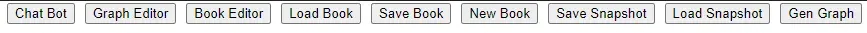

# UI

There are several buttoms  

* ChatBot
  * Switch to ChatBot Layout
* Graph Editor
  * Swith to Graph Mode, see [Graph Mode](/Graph)
* Book Editor
  * Edit the cookbook such content or chapters
* Load Book
  * Load Cookbook from json file
* Save Book
  * Save Cookbook from json file
* New Book
  * clean all
* Save Snapshot
  * Save chathistory, prompt as json file
* Load Snapshot
  * Load chathistory, prompt as json file
* Gen Graph
  * Convert prompt to Graph Mode, see [Graph Mode](/Graph)