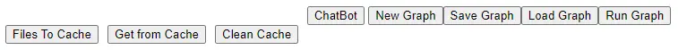

# UI

There are several buttoms  

## Frontend Panel
* ChatBot
  * Change to ChatBot Layout
* New Graph
  * clean the canvas and graph
* Save Graph
  * Save the graph into json
* Load Graph
  * Load the graph from json
* Run Graph
  * Run the Graph with AI, real generating

## Backend Panel
* File to Cache
  * transmit files to AI environment
* Get from Cache
  * transmit files to AI environment
* Clean Cache
  * delete all files at AI environment